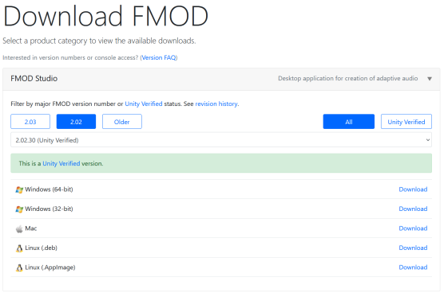

# Pizza Tower FMOD Studio Project Recreation

This project/tool aims to make a improvement/fixes to the Pizza Tower sounds and to make modding sounds easier by just opening this with FMOD Studio instead of using other unofficial tools, allowing for any custom events/sounds/groups/etc to be able being added in the game!

## Opening the project
First of all, the program that needs to open this is [FMOD Studio](https://www.fmod.com) (which what Pizza Tower uses for it's sounds), it's free! It need to be the version above than 2.02.13. And ofcourse, you'll need to have a knowledge on how to use FMOD Studio to modify

[Here a quick Youtube Video on how to use FMOD Studio](https://youtu.be/7A1HMOsD2eU)

After installing FMOD Studio, don't open the project yet, it needs to have the Pizza Tower Assets first, to do that, extract the Pizza Tower banks files at `sound\Desktop` to wav with the [Unofficial FMOD Banks Tool](https://gamebanana.com/tools/12100)

Put it into the repository `Assets` folder, and you should be good to go to open this with FMOD Studio!

## Modifying
When modifying the project, please to make sure to use the event templates that's provided in event tabs when your adding a new events, any Pull Requests that doesn't do this will be ignored/held for reviews until it get resolved.

## Credits
* [Raltyro](https://github.com/Raltyro) - Maintainer ([Gamebanana](https://gamebanana.com/members/1777465), [Twitter](https://twitter.com/Raltyro))
* [AwfulNasty](https://github.com/AwfulNasty) - MAJOR Contributions help on adding bunch of sfx events
* [MeliaDev](https://github.com/MeliaDev) - Contributions help on adding events ([Twitter](https://twitter.com/darkdagirl))
* [thecubitosishere](https://github.com/thecubitoishere) - Contributions help on adding events
